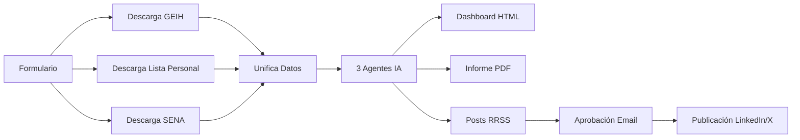

[readme-proyecto-dane.md](https://github.com/user-attachments/files/23811946/readme-proyecto-dane.md)
# 📊 Sistema Automatizado de Indicadores Laborales del Caribe con IA

[](https://opensource.org/licenses/MIT)
[](https://n8n.io)
[](https://www.dane.gov.co)

> **Proyecto ganador del Reto Universidad del Magdalena - Equipo "Datos con Flores" (El Rosal, Cundinamarca)**

Sistema automatizado que transforma datos abiertos del DANE en análisis laborales completos con IA generativa, dashboards interactivos y difusión automática en redes sociales.


---

## 🎯 ¿Qué problema resuelve?

Las ORMET (Observatorios del Mercado Laboral) actuales:
- ❌ Generan indicadores manualmente
- ❌ Tardan meses en producir informes
- ❌ Datos dispersos y sin trazabilidad
- ❌ Baja difusión de los resultados

**Nuestra solución:**
- ✅ Análisis en **menos de 5 minutos**
- ✅ Automatización end-to-end con n8n
- ✅ IA generativa (GPT-4) para narrativa
- ✅ Difusión automática en redes sociales
- ✅ 100% replicable en otros territorios

---

## 🚀 Características Principales

### 📥 Ingesta Automática de Datos
- **GEIH 2020-2023**: Gran Encuesta Integrada de Hogares
- **Lista Personal**: Afiliados a seguridad social
- **SENA**: Inscritos en Agencia Pública de Empleo
- Filtrado por territorio, sector y período

### 🤖 Análisis con IA
Tres agentes especializados trabajando en paralelo:

1. **Dashboard Visualización** 📊
   - Genera JSON estructurado para gráficos interactivos
   - KPIs con colores y tendencias
   - Tablas resumen y heatmaps territoriales

2. **Informe Técnico Profesional** 📄
   - Documento Markdown de 4,000+ palabras
   - Metodología, análisis sectorial y recomendaciones
   - Listo para exportar a PDF

3. **Content Manager RRSS** 📱
   - Contenido optimizado para 7 plataformas
   - Hilos de Twitter, carruseles de Instagram
   - Posts de LinkedIn con tono profesional

### 📊 Visualización Dinámica
- Dashboard HTML interactivo (Chart.js)
- Exportable a Power BI
- Responsive y accesible

### 🌐 Difusión Automática
- Publicación programada en LinkedIn y X (Twitter)
- Generación de imágenes con DALL-E
- Hashtags y CTAs optimizados

---

## 🛠️ Tecnologías Utilizadas

| Tecnología | Propósito |
|------------|-----------|
| **n8n** | Orquestador low-code |
| **GPT-4.1 Mini** | Análisis y generación de narrativa |
| **Google Gemini 2.0** | Agente de redes sociales |
| **Chart.js** | Visualizaciones web |
| **DALL-E 3** | Generación de imágenes |
| **SerpAPI** | Búsqueda de contexto adicional |

---

## 📦 Instalación

### Prerrequisitos
- Node.js 18+ 
- n8n instalado (`npm install n8n -g`)
- Cuentas API:
  - OpenAI (GPT-4)
  - Google AI (Gemini)
  - SerpAPI (opcional)
  - LinkedIn & X (para publicación)

### Paso 1: Clonar el repositorio
```bash
git clone https://github.com/tu-usuario/dane-sistema-laboral-ia.git
cd dane-sistema-laboral-ia
```

### Paso 2: Importar flujo en n8n
1. Abre n8n: `n8n start`
2. Ve a **Workflows** → **Import from File**
3. Selecciona `Sistema-Automatizado-de-Indicadores-Laborales-del-Caribe-con-IA.json`

### Paso 3: Configurar credenciales
En cada nodo que lo requiera:
- **OpenAI Chat Model**: API Key de OpenAI
- **Google Gemini**: API Key de Google AI
- **LinkedIn Post**: OAuth2 de LinkedIn
- **X Post**: OAuth2 de Twitter/X
- **Gmail**: OAuth2 de Gmail

### Paso 4: Activar el flujo
1. Clic en **Activate** en la esquina superior
2. Copia la URL del webhook del nodo "🏆 Configuración Reto DANE2"

---

## 💡 Uso

### Interfaz Web
1. Accede a la URL del webhook
2. Completa el formulario:
   - **Territorialidad**: Departamental / Municipal / Regional
   - **Sector Económico**: Agropecuario, Industrial, Servicios, etc.
   - **Indicadores Clave**: Desempleo, Informalidad, Analfabetismo
   - **Departamentos**: Santa Marta, Magdalena, etc.
   - **Período de Análisis**: 2020-2023
   - **Límite de registros**: 1000 (recomendado)
3. Envía el formulario

### Proceso Automatizado


### Salidas Generadas
- ✅ **Dashboard HTML** interactivo
- ✅ **Informe técnico** en Markdown
- ✅ **Posts optimizados** para 7 redes sociales
- ✅ **Imágenes generadas** con DALL-E
- ✅ **Emails de aprobación** antes de publicar

---

## 📁 Estructura del Proyecto

```
dane-sistema-laboral-ia/
├── README.md                          # Este archivo
├── Sistema-Automatizado-*.json        # Flujo n8n exportado
├── docs/
│   ├── Presentacion-Proyecto.docx     # Propuesta técnica
│   ├── Presentacion-PDF.pdf           # Slides del proyecto
│   ├── assets/                        # Imágenes del README
│   └── manual-usuario.md              # Guía de 12 páginas
├── ejemplos/
│   ├── dashboard-santa-marta.html     # Ejemplo de salida
│   ├── informe-magdalena.md           # Ejemplo de informe
│   └── posts-redes-sociales.json      # Ejemplos de contenido
├── LICENSE                            # Licencia MIT
└── CONTRIBUTING.md                    # Guía de contribución
```

---

## 🎓 Casos de Uso

### 1. ORMET Santa Marta
**Antes**: 3 meses para generar informe trimestral  
**Después**: 5 minutos con análisis más profundo

### 2. Alcaldía de El Rosal
**Necesidad**: Monitorear empleo agrícola estacional  
**Solución**: Filtro por sector "Agropecuario" + departamento "Cundinamarca"

### 3. Universidad del Magdalena
**Uso**: Análisis académicos y tesis de grado  
**Ventaja**: Datos actualizados y metodología replicable

---

## 📊 Impacto y Escalabilidad

### Beneficio Social
- Acceso democrático a análisis laborales complejos
- Decisiones basadas en datos en tiempo real

### Beneficio Económico
- Reducción del 95% en tiempo de análisis
- Ahorro en costos de personal dedicado

### Beneficio Ambiental (futuro)
- Integración con datos de clima
- Análisis de empleo vs. estacionalidad ambiental

### Escalabilidad
- ✅ Modular: cambiar territorio en 1 minuto
- ✅ Código abierto (MIT)
- ✅ Capacitación de 2 horas
- ✅ Actualización automática con nuevos datos DANE

---

## 🤝 Contribuir

¡Contribuciones son bienvenidas! Por favor:

1. Fork el proyecto
2. Crea tu branch: `git checkout -b feature/nueva-funcionalidad`
3. Commit cambios: `git commit -m 'Agrega nueva fuente de datos'`
4. Push: `git push origin feature/nueva-funcionalidad`
5. Abre un Pull Request

Ver [CONTRIBUTING.md](CONTRIBUTING.md) para más detalles.

---

## 📄 Licencia

Este proyecto está bajo la Licencia MIT. Ver [LICENSE](LICENSE) para más información.

---

## 👥 Equipo

**Datos con Flores - El Rosal, Cundinamarca**

- 🌟 **Aliado**: Universidad del Magdalena - ORMET Caribe
- 📅 **Fecha**: 27 de noviembre de 2025

---

## 📞 Contacto

- **Email**: datos.territoriales@ejemplo.com
- **Twitter/X**: [@DatosConFlores](https://twitter.com/datosconflores)
- **LinkedIn**: [Datos con Flores](https://linkedin.com/company/datosconflores)
- **Issues**: [GitHub Issues](https://github.com/tu-usuario/dane-sistema-laboral-ia/issues)

---

## 🙏 Agradecimientos

- Universidad del Magdalena por el reto
- DANE por los datos abiertos
- Comunidad n8n por el soporte
- ORMET Caribe por la retroalimentación

---

## 📚 Recursos Adicionales

- [Documentación DANE](https://www.dane.gov.co/index.php/servicios-al-ciudadano/servicios-informacion/microdatos)
- [n8n Documentation](https://docs.n8n.io/)
- [Video Demo 3min](https://youtu.be/ejemplo) *(próximamente)*
- [Wiki del Proyecto](https://github.com/tu-usuario/dane-sistema-laboral-ia/wiki)

---

<div align="center">

**[⬆ Volver arriba](#-sistema-automatizado-de-indicadores-laborales-del-caribe-con-ia)**

Hecho con ❤️ por el equipo Datos con Flores

</div>
